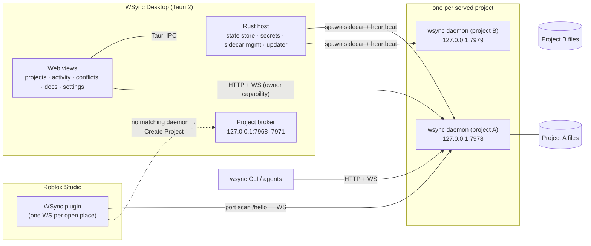

# WSync — Design Document

**Version:** 1.0 (initial design)
**Date:** 2026-08-07
**Status:** Draft for review

WSync is a filesystem ↔ Roblox Studio sync tool that combines the **desktop app, project management, and CLI surface of Ro-Sync** with the **sync engine, project format, and full-DataModel middleware of Argon** — plus a first-class **divergence resolution flow** that lets the user choose, file by file or all at once, which disk changes get pushed into Studio and when Studio gets written back to disk.

### Sources analyzed

| Repo | Version at analysis | License | How WSync uses it |
|---|---|---|---|
| [`Pugbread/ro-sync`](https://github.com/Pugbread/ro-sync) | desktop 0.3.0 · plugin **2.5.0** · protocol **7** (live dev copy at `~/.terminal64/widgets/ro-sync`; GitHub lags at 2.4.1 / protocol 6) | Owned by the WSync author | **Concept & surface reference for a clean remake.** The proven UX, CLI surface, docs/LLM steering, and invariants carry over; the implementation does not (§1.4). |
| [`argon-rbx/argon`](https://github.com/argon-rbx/argon) | 2.0.29 | Apache-2.0 | **Fork/port** the Rust sync core (vfs, middleware, tree, processor) with attribution. |
| [`argon-rbx/argon-roblox`](https://github.com/argon-rbx/argon-roblox) | (Studio plugin) | Apache-2.0 | **Fork/port** the Luau plugin core (Dom, Processor, Tree, Watcher, Fusion UI) with attribution. |

---

## 1. Overview

### 1.1 Goals

1. **Full-project, two-way sync** of the entire DataModel — all instance classes, properties, attributes, and tags — using Argon's middleware/snapshot engine (not Ro-Sync's 4-class script-only scope), at Argon's speed (native Rust, incremental diffing, no full-tree rescans).
2. **Ro-Sync's app experience**: a Tauri desktop app with a project list, per-project serve toggles, live activity feed, a conflicts view, settings, and built-in command docs. Multiple projects served concurrently, one daemon per project.
3. **Divergence resolution with selective reverse sync**: when Studio and disk differ (first connect, reconnect after offline edits, or live conflicts), the user explicitly chooses the outcome — *Keep Studio* (write Studio → disk), *Keep Disk* (push disk → Studio, either **everything** or a **hand-picked subset of files**, staged one by one), or *Cancel*. Nothing changes until confirmed.
4. **A single `wsync` CLI** carrying **all 62 Ro-Sync commands** (same names, arguments, and semantics) plus Argon's project/build tooling (`init` templates, `build`, `sourcemap`, `exec`, `studio`, `debug`, `update`, `config`, session `stop`).
5. **Safety as a feature**: baseline-tracked conflict detection, bounded/chunked bulk transfers with fencing and backups, one-undo bulk applies, audit logging, and loopback-only servers with capability tokens.

### 1.2 Non-goals (v1)

- Cloud sync, team collaboration, or any non-localhost transport.
- Syncing during playtest. Play/Run-mode DataModels are separate and never reverse-sync (Ro-Sync's rule, kept verbatim).
- A VS Code extension (Argon has one; WSync's sourcemap + open-in-editor support covers editors generically in v1).
- roblox-ts first-class support beyond what the forked Argon core already provides (`--ts` passthrough kept, not extended).
- Backwards compatibility with Ro-Sync's on-disk 4-class projection for mixed teams (one-time migration instead, §15).

### 1.3 Heritage map

| Area | Comes from | Notes |
|---|---|---|
| Sync engine (vfs, snapshots, diffing, middleware) | **Argon** | Forked Rust core |
| Project format (`*.project.json`, Rojo-compatible) | **Argon** | Extended with WSync fields |
| Studio plugin core (Dom, processors, watcher, Fusion UI) | **Argon plugin** | Transport swapped to WebSocket |
| Desktop app (views, project registry, sidecar lifecycle) | **Ro-Sync** | Reimplemented, same UX |
| Daemon lifecycle (records, locks, heartbeats, idempotent start) | **Ro-Sync** | Reimplemented in the forked core |
| Wire protocol shape (WS + request/response ops + events) | **Ro-Sync** | Protocol reset to `wsync/1` |
| Conflict engine (baselines, parked conflicts, resolve) | **Ro-Sync** | Generalized from paths to instances |
| Divergence modal + selective staging UX | **Ro-Sync** | Powered by Argon's tree diff |
| Studio-side prompts + diff/script-diff widgets | **Argon plugin** | Kept for mid-session batches |
| CLI: live inspection/writes/playtest/capture/cloud (62 cmds) | **Ro-Sync** | Compatibility surface, §11 + Appendix A |
| CLI: build/sourcemap/templates/sessions | **Argon** | Merged in, §11.3 |
| Security model (loopback, origin allowlist, owner capability) | **Ro-Sync** | §12 |

### 1.4 Remake stance

Ro-Sync is the author's own prior art: the concept is proven and the surface is right, and WSync deliberately does **not** inherit the implementation. The old tree accumulated organic legacy — two same-named Studio→disk push paths (live WS helper vs. bulk HTTP route), three transports side by side (`/poll`, `/events`, `/ws`), singleton daemon state kept for widget-era back-compat, host-adapter branches for a retired surface — and its 4-class sync engine is being replaced outright.

The rule for WSync: **spec first, reference second.** Build from this document; consult the Ro-Sync tree to answer "how did the working version behave"; port code only deliberately, in isolated pieces genuinely worth carrying (path-encoding rules, policy-check assertions, invariant lists). One mechanism per job, no legacy aliases at birth. What must carry over unchanged in *behavior* — not in code — is the command surface, the generated docs, and the LLM steering (§10.2, §10.5–10.6).

---

## 2. The two parents — what each got right

### 2.1 Ro-Sync in one paragraph

Ro-Sync is a **product**: a Tauri 2 desktop app + Rust (axum) daemon + Luau Studio plugin, connected by a JSON WebSocket protocol (protocol 7 in the current dev copy). Its strengths are everything *around* sync: a real project manager, an activity feed, a first-connect divergence modal with per-file staging, a per-path conflict engine with baselines, a 62-command CLI designed for both humans and LLM agents (machine-readable `--raw` output, `commands`/`context`/`plan` introspection, playtest orchestration, viewport capture, Open Cloud uploads, workflows), phased bulk transfers with fencing/backups/receipts, and an unusually disciplined safety posture (18 CI policy checks, invariants doc, audit log, authenticated daemon lifecycle). Its weakness is the sync engine itself: **only `Folder`/`Script`/`LocalScript`/`ModuleScript` under 8 services round-trip to disk**; everything else lives only in Studio and is reachable only through live remote commands.

### 2.2 Argon in one paragraph

Argon is an **engine**: a single Rust binary (CLI + actix-web server) plus a Fusion-based Luau plugin, speaking MessagePack over HTTP long-polling. Its strengths are the sync core: a Rojo-compatible `*.project.json` tree, **26 sync rules mapping the whole DataModel to files** (scripts, JSON/TOML/YAML/Msgpack/Markdown/CSV/txt modules and values, `*.model.json`, `.rbxm`/`.rbxmx`, `.data.json` property sidecars), an in-memory `WeakDom` tree with a path→instance index for **incremental, change-proportional diffing**, a debounced self-write-aware VFS, two-way sync including file↔folder promotion/demotion, instant `build`/`sourcemap` from the live tree, sessions, templates, and self-update. Its weaknesses are the product layer: no desktop app, long-poll transport, a coarse take-it-or-leave-it initial sync (Server/Client/None priority), a `changes_threshold` prompt instead of real conflict detection, and no per-file selectivity.

### 2.3 The differences that drive this design

| Dimension | Ro-Sync | Argon | WSync decision |
|---|---|---|---|
| Sync scope | 4 classes, 8 services, scripts only | Full DataModel via middleware | **Argon** (§5) |
| Project format | Implicit root mapping + `ro-sync.json` | Rojo-compatible `*.project.json` | **Argon**, extended (§5.6) |
| Transport | WebSocket (JSON text frames) | HTTP long-poll (MessagePack) | **WebSocket + JSON** (§6.1) |
| Live commands | 62-command request/response op surface | `ExecuteCode` broadcast only | **Ro-Sync surface** on WSync protocol (§6.3, §11) |
| Initial divergence | Chunked compare → app modal → full or per-file choice | Plugin-side diff → Accept/Diff/Cancel prompt, whole-set only | **Ro-Sync flow**, Argon diff as the data source (§8) |
| Ongoing conflicts | Baseline engine, parked conflicts, resolve UI/CLI | None (threshold prompt only) | **Ro-Sync engine**, instance-granular (§7.4) |
| Bulk safety | Phased, fenced, backed-up, receipts, one-undo | `changes_threshold` prompt | **Ro-Sync mechanics** (§8.5) |
| Desktop app | Tauri 2 + vanilla JS views | None | **Ro-Sync** (§9) |
| Plugin UI | React-Lua panel + fallback UI | Fusion pages/widgets incl. diff viewers | **Argon plugin UI** + Ro-Sync connection model (§10) |
| Daemon model | One daemon per project, ports 7878–7890, broker | Sessions file, one port per serve | **Merged** (§4.2) |

---

## 3. System architecture

### 3.1 Components

1. **`wsync` (Rust, one binary)** — the CLI *and* the daemon. Forked from Argon's core (`vfs`, `middleware`, `core/{tree,snapshot,changes,meta,processor,queue}`, `project`, `resolution`, `sessions`, `workspace`, `installer`, `updater`, `studio`, `logger`, `stats`), with the server layer rewritten on **axum 0.7 + tokio** (WebSocket support, and the daemon-lifecycle patterns being adopted are axum-shaped), plus new subsystems: conflict engine, divergence coordinator, remote-op router, artifact store, workflow runner, audit log, lifecycle manager.
2. **WSync Desktop (Tauri 2)** — reimplementation of Ro-Sync's app: vanilla-JS ES-module frontend (no framework, no build step), Rust host with narrowly scoped commands, `wsync` bundled as a **sidecar** binary, project broker for Studio-triggered project creation, signed updater with key pinning.
3. **WSync Studio plugin (Luau)** — fork of `argon-roblox` (Fusion 0.3 UI, `Client`/`Core`/`Processor`/`Tree`/`Watcher`/`Lib/Dom`), with: transport swapped to `HttpService:CreateWebStreamClient` WebSocket, Ro-Sync-style daemon discovery (port scan + GameId match + "Create Project"), and a new `Remote/` module family implementing the request/response op surface (codec, reflection, clipboard, capture, playtest — reimplemented, §5.4).

### 3.2 Process & port model



- **Daemon ports:** default `7978`, scan range `7978–7990`. **Broker ports:** `7968–7971`. Deliberately disjoint from Ro-Sync (7878–7890 / 7867–7870) and Argon (8000) so all three tools can coexist during migration.
- **One daemon per project** (Ro-Sync model), tracked two ways: per-project **runtime records** with locks and boot IDs (authoritative, §13) and a **sessions file** for the Argon-style `wsync stop`/`--list` convenience surface.
- **One Studio connection per daemon** — a single plugin owns the live bridge at a time; a second connect for the same place is rejected with a typed reason.
- Everything binds **loopback only**.

### 3.3 Runtime wiring

- Desktop spawns daemons as sidecars: `wsync daemon start --project <p> --managed-by desktop --owner-token-env WSYNC_OWNER_TOKEN --data-dir <appdata> --raw`, keeps handles for kill-on-exit, and sends `/manager-heartbeat` (5-minute timeout, 30-second "suspect" grace to survive laptop sleep — Ro-Sync's watchdog semantics).
- Headless use: `wsync serve --project <p>` (foreground, for terminals/launchd/systemd) or `wsync daemon start` (background, idempotent — a matching running daemon is returned, never duplicated; a port serving a *different* canonical project is a hard error).
- The plugin port-scans `7978–7990` `GET /hello` for a daemon whose project matches the open place's GameId; only if none matches does it offer **Create Project** through the Desktop broker (explicit click — discovery alone never writes to disk).

---

## 4. Sync engine (Argon core, kept)

The engine is forked from Argon and its behavior is preserved unless stated. The load-bearing properties to keep intact:

- **In-memory `WeakDom` tree** (`rbx_dom_weak`) + `Meta` side-tables, with a `MultiMap<PathBuf, Ref>` path→instance index. FS events resolve **up the path** to the owning instance(s), and only that subtree is re-snapshotted — sync cost scales with the change, not the project.
- **Single processor thread** consuming both VFS events and client writes from channels — all tree mutation serialized, no fine-grained locking.
- **Debounced, self-write-aware watching**: 100 ms debouncer; `pause()/resume()` bracketing around WSync's own disk writes plus a 300 ms post-resume grace window; additionally a per-path quiet map (`push_quiet`, 1500 ms, Ro-Sync) for surgical echo suppression — both mechanisms, because the coarse pause protects bulk applies while the per-path stamp protects concurrent unrelated edits during live syncback.
- **Field-equality short-circuit diffing**: unchanged name/class/properties/meta produce zero wire traffic; children paired by `(name, class)` with each existing child matched at most once.
- **Interned identifiers** (`Ustr`/`UstrMap`) for classes and property names; deterministic minimal-diff JSON output (sorted keys, ≤4-decimal floats) for `project.json`/`.data.json` git-friendliness.
- **CRLF normalization** (`ignore_line_endings`), **trash-instead-of-delete** option (`move_to_bin`), legacy `ContentId → Content` property migrations applied on every property ingest.
- **Zero-rescan builds**: `wsync build`/`sourcemap` serialize straight from the live tree; `--watch` re-runs on the internal change bus.

### 4.1 Snapshots and changes (wire data model)

Kept from Argon exactly:

```
Snapshot        = { id: Ref, meta: Meta, name, class, properties: {prop: TaggedValue}, children: [Snapshot] }
AddedSnapshot   = Snapshot + { parent: Ref }
UpdatedSnapshot = { id: Ref, meta?, name?, class?, properties? }        // all optional but id
Changes         = { additions: [AddedSnapshot], updates: [UpdatedSnapshot], removals: [Ref] }
```

- `Ref` = 128-bit id. Random per instance, minted by whichever side first sees the instance; agreed thereafter. **JSON encoding: 32-char lowercase hex string** (Argon's msgpack used 16-byte buffers; protocol v1 is JSON, §6.1). The all-zeros ref is the "root" sentinel.
- Properties use Argon/Rojo's **tagged unions** (`{"Float64": 1.5}`, `{"CFrame": {...}}`, `{"Attributes": {...}}`, `{"Tags": [...]}` …) — the full `EncodedValue` tag set from the Argon plugin is the reference implementation. `Ref`-typed and `SharedString` properties remain unsupported (same as both parents).
- `Meta` carries `keepUnknowns` and `meshSource` (Argon's MeshPart round-trip), plus WSync's `sourcePaths` (relative file paths backing the instance — needed by the divergence UI, §8.4).

### 4.2 Middleware (file ↔ instance mapping)

Argon's default sync rules are adopted with one deliberate departure (first match wins, overridable per project via `syncRules`): **script class and RunContext are fully encoded in the file suffix** — one suffix, one meaning, with no `legacyScripts` mode flag (the flag multiplexed `.server`/`.client` onto two meanings each, which made places mixing Legacy and RunContext scripts impossible to round-trip; the field is still parsed and ignored). RunContext Plugin has no suffix and falls back to `.server.*` with the value preserved in the data sidecar. Summary of the mapping (full rule table in Appendix D):

| Files | Instance |
|---|---|
| `*.project.json` | nested project |
| `*.data.json` / `*.meta.json` (+ `init.meta.json`) | property/attribute/tag sidecar for the owning instance |
| `*.server.luau/.lua` (+ `init.server.*`) | `Script`, RunContext Legacy (the classic script) |
| `*.client.luau/.lua` (+ `init.client.*`) | `Script`, RunContext Client |
| `*.local.luau/.lua` (+ `init.local.*`) | `LocalScript` |
| `*.runserver.luau/.lua` (+ `init.runserver.*`) | `Script`, RunContext Server |
| `*.luau/.lua` (+ `init.*`) | `ModuleScript` |
| `.src.*` legacy forms | same, deprecated (warning) |
| `*.txt` | `StringValue` |
| `*.md` | `StringValue` with Roblox rich-text conversion |
| `*.csv` | `LocalizationTable` |
| `*.json` (excl. model/data/meta) | `ModuleScript` returning the literal |
| `*.toml`, `*.yaml`, `*.yml`, `*.msgpack` | `ModuleScript` returning the literal |
| `*.model.json` | full instance subtree (JSON model schema) |
| `*.rbxm`, `*.rbxmx` | full instance subtree (binary/XML model) |
| directory with no init match | `Folder` |

**Write direction (syncback):** Argon ships write support for scripts, `StringValue` (`.txt`), and `LocalizationTable` (`.csv`); everything else becomes directory + `.data.json`. WSync keeps that default and adds one improvement, off by default:

- `syncback_model_json` (config, default `false`): when a **leaf** non-script instance with no dedicated middleware is created in Studio, emit `<Name>.model.json` instead of `<Name>/.data.json`. Subtrees still use folders + sidecars. This keeps small props/values reviewable as single files without inventing new formats.

`.data.json` semantics (className inference, `originalName`, attributes/tags folding, empty-sidecar deletion, MeshPart `meshSource` round-trip, number truncation) are kept from Argon as-is.

### 4.3 Project format

Argon's `Project` schema, Rojo aliases included, plus WSync extensions (all optional):

```jsonc
// default.project.json (any *.project.json accepted)
{
  "name": "my-game",
  "tree": { "$className": "DataModel", "ReplicatedStorage": { "$path": "src/Shared" }, ... },
  "host": "localhost", "port": 7978,
  "gameId": 123456, "placeIds": [789],
  "ignoreGlobs": ["**/*.spec.luau"],
  "syncRules": [ { "type": "ModuleScript", "pattern": "*.mod.luau" } ],
  "syncback": { "ignoreGlobs": [], "ignoreNames": [], "ignoreClasses": [], "ignoreProperties": [] },

  // WSync extensions
  "groupId": 0,                  // Ro-Sync: creator context for Open Cloud commands
  "wally": { "enabled": false, "folder": "Packages" },
  "autoReconnect": true          // plugin hint, mirrors Ro-Sync's per-project setting
}
```

- Tree resolution, `$path` optional/required semantics, `$properties`/`$attributes`/`$tags`/`$keepUnknowns` (alias `$ignoreUnknownInstances`), service-name class inference, and nested projects all behave as in Argon.
- **`AvoidSync` Studio attribute** (from Ro-Sync): a boolean attribute set to `true` on any instance excludes that subtree from sync in **both** directions, including divergence comparison. This is the Studio-side counterpart to `ignoreGlobs` and requires no file edits.
- Ro-Sync's `ro-sync.json` is not used; `wsync init` migrates one when found (§15).

### 4.4 Templates and scaffolding

Argon's six templates (`place`, `quick`, `model`, `package`, `plugin`, `empty`) ship embedded, install to `~/.wsync/templates/`, and are versioned/updatable. `wsync init` also performs Ro-Sync's `init` duties: writes the project config and the generated agent docs (`wsync.md`, `AGENTS.md`, `CLAUDE.md` marker blocks — Ro-Sync's `refresh` machinery, §11).

---

## 5. Wire protocol — `wsync/1`

### 5.1 Transport decision

**One WebSocket per client** (plugin, app, CLI watcher) carrying **JSON text frames**, plus a small set of HTTP routes for discovery and bulk phases.

Rationale:
- Ro-Sync proves Studio-side WS works today: `HttpService:CreateWebStreamClient(Enum.WebStreamClientType.WebSocket, { Url = url })`, JSON over **text frames** (which is what rules out MessagePack-on-WS — binary frames are not the proven path; JSON's overhead is acceptable given payload bounds, and it makes `wsync watch` and debugging trivial).
- WS removes Argon's 60 s long-poll re-issue loop, lets the daemon push sync ops with no polling latency, and carries request/response ops (needed for the 62-command surface) and app events on the same connection with `request_id` correlation.
- Argon's msgpack long-poll surface is **always served** — it is protocol v1's fallback transport, used by the WSync plugin whenever a Studio build lacks `CreateWebStreamClient`. Version gating is surface-scoped: `/hello` and the WS hello report WSync's real version (`0.1.x`) and `protocol: 1`; the msgpack `GET /details` reports the Argon-compatible constant `2.0.29` only when `compat_argon` is enabled (so a **stock Argon plugin** passes its own semver gate), and the real version otherwise. The WSync plugin's long-poll path gates on `/hello`'s `protocol` field whenever `/hello` answers, falling back to strict `/details` semver only against daemons with no `/hello`.

### 5.2 HTTP routes

| Route | Method | Purpose |
|---|---|---|
| `/hello` | GET | Identity for discovery: `{name, version, protocol: 1, project, canonicalProject, gameId, placeIds, bootId, pid, port, managedBy, projectInit}` |
| `/ws` | GET upgrade | The realtime channel |
| `/snapshot` | GET | Full or subtree snapshot export (`?ref=<hex>`; also backs `wsync snapshot`) |
| `/choice/source` | GET | Per-row divergence sources for staging diffs (`?choiceId=&id=`; each side ≤256 KiB with truncated flags) |
| `/compare` | POST | Chunked divergence-set upload from the plugin (§8.4) |
| `/choice` | GET·POST | Pending divergence decision status / submit `studio·disk·cancel` |
| `/choice/details` | GET | Page the immutable divergence detail list (cursor, ≤1024/page, ≤512 KiB) |
| `/choice/selection` | POST | Chunked selective-pull id submission with receipts (§8.3) |
| `/resolve` | GET·POST | List / resolve parked conflicts (§7.4) |
| `/projects/init` | POST | Studio-authorized project creation (broker/daemon, §9.6) |
| `/artifacts/*` | POST·GET | Lease / chunk / finalize / read / consume bounded binary artifacts (capture, clipboard, playtest results) |
| `/stop` | POST | Authenticated shutdown (used by `wsync stop` / `daemon stop`) |

Browser-origin requests require an allowlisted app origin **and** the owner capability token; native loopback clients (plugin, CLI) carry no `Origin` and skip that gate (Ro-Sync's CORS posture).

### 5.3 WebSocket frames

Handshake: client sends `{"type":"hello", "clientId", "role":"plugin"|"agent"|"watch"|"app", "protocol":1, "name", "capability"?}`. The daemon replies with its own hello — `{type:"hello", name, version, gameId, placeIds, rootRefs: ["<32-hex>", …]}` — or a `shutdown` frame (`{reason, code, retryable}`) on protocol/capability mismatch. Heartbeat `ping`/`pong` ~2 s with timeout-forced reconnect.

**Frame envelope (normative):** every frame is a flat JSON object with a `type` tag and its payload fields inline — `{"type":"sync", "additions":[…], "updates":[…], "removals":[…]}`, `{"type":"push", "ops":{…}}` — not a nested single-key wrapper. (The plugin's WS transport is already built to this reading.)

**Server → client**

| Frame | Payload | Notes |
|---|---|---|
| `sync` | `Changes` | FS-driven diff to apply to Studio (batched ≤256 ops / ≤512 KiB / 2 ms window) |
| `details` | `ProjectDetails` | Project file changed (name/gameId/placeIds/rootRefs) |
| `execute` | `{code}` | `wsync exec` broadcast |
| `push-result` | `{ok, applied, skipped, conflicts, errors}` | Ack for a `push` frame |
| `event` | `conflict` · `choice-needed` · `choice-made` · `sync-activity` · `config-changed` · `project-init` · `plugin-status` | App/watch feed (sanitized, allowlisted fields) |
| `request` | `{request_id, op, args, timeout_ms}` | Daemon → plugin remote op (§6.3 inverted for ops executed in Studio) |
| `shutdown` | `{reason, code, retryable}` | Typed disconnect |

**Client → server**

| Frame | Payload | Notes |
|---|---|---|
| `push` | `{ops: Changes}` | Live Studio → disk syncback batch (0.5 s aggregation, §7.2) |
| `response` | `{request_id, ok, value | error, meta:{op, durationMs, protocol}}` | Plugin's answer to a `request` |
| `event-sub` | `{topics}` | App/watch clients choose event feeds |

Remote-op error codes are Ro-Sync's, kept verbatim: `UNKNOWN_OP, NOT_FOUND, PERMISSION_REQUIRED, TIMEOUT, INVALID_ARGUMENT, CONFLICT, PLUGIN_ERROR`. Every live command has a **5 s default client timeout** (playtest/capture flows carry their own longer deadlines). Every queue is bounded with explicit overload results; connect/auth/request/write/shutdown all have deadlines (Ro-Sync invariants, adopted wholesale).

### 5.4 Remote-op catalog

The daemon routes CLI/app requests to the plugin over `request`/`response`. Ops (Ro-Sync's set, names kept): `get, set, ls, tree, query, find, find_by_attr, new, rm, mv, class_info, enum_list, enums, set_attr, rm_attr, attr_ls, add_tag, rm_tag, tag_ls, call, select_get, select_set, eval, logs, save, undo, redo, waypoint, version, ping, capabilities, transaction_begin, transaction_finish, clipboard_copy, clipboard_paste, capture_* (prepare/read/close — bounded RGBA chunk sessions backing the ui/model/viewport renderer), transmit_* (prepare/read/close), playtest_* (start/run_start/status/run_poll/contexts/wait/request/capture/stop/run_cancel), open_in_editor` (the last one is Argon's `/open` behavior folded into the op surface). The value codec is bounded and cycle-safe (depth ≤64, ≤20 000 nodes, ≤10 000 table entries, strings ≤4 MiB — Ro-Sync's `RemoteCodec` limits).

---

## 6. Two-way sync & conflict model

### 6.1 Live disk → Studio

Argon's pipeline, unchanged in substance: VFS event → path→id resolution → subtree re-snapshot → field-diff → `Changes` → `sync` frame. The plugin applies additions → updates → removals inside one `ChangeHistoryService` waypoint per batch, resolves missing parents via on-demand subtree fetch (`LiveHydrate`), recreates instances on class change, and writes script sources through `ScriptEditorService:UpdateSourceAsync` **only** (never raw `.Source` — an open editor draft must not be clobbered; a failed `UpdateSourceAsync` is a *failed op*, reported, never silently skipped — Ro-Sync invariant).

### 6.2 Live Studio → disk (syncback)

Argon plugin's watcher model: `ChildAdded/Removed`, `Changed` (Parent excluded), `AttributeChanged`, CollectionService tag signals → read-processor snapshots → 0.5 s aggregated `push` frames, 0.1 s anti-echo window after server-applied syncs. Server applies via write middleware (file↔folder promotion/demotion, sidecar maintenance, project-node splicing for project-tree instances, name sanitization with `originalName`). Gates kept from Argon: `TwoWaySync` (master switch), `OnlyCodeMode` (default on: only script-related subtrees sync back), `SyncbackProperties` (non-script property syncback, default off), plus per-project `syncback` filters. Renames preserve suffixes; reparents remain remove+add (documented limitation, §17).

### 6.3 What's new vs Argon: the conflict engine

Argon applies whatever arrives last (guarded only by a count threshold). WSync inserts Ro-Sync's **baseline conflict engine**, generalized from file paths to instances:

- For every synced instance the daemon keeps a **baseline**: content hash of the last state both sides agreed on (per-property hash for scripts: normalized `Source`; for others: the encoded property map), stamped on every successfully applied change in either direction.
- **FS change arrives** → if Studio-side state (per last known applied state) still matches baseline → propagate; if bytes identical → refresh baseline; if **both** sides drifted → **park a conflict**, propagate nothing.
- **Studio push arrives** → mirror logic (`Apply / NoChange / Conflict`).
- Destructive-op provenance (delete/rename on either side) is tracked so a conflict still surfaces when one side deleted what the other edited.
- Parked conflicts: broadcast as `conflict` events, listed via `GET /resolve`, shown in the app's Conflicts view and `wsync conflicts`; resolved per item (`keep local` → push disk state to Studio; `keep studio` → syncback write to disk) or in bulk, via `POST /resolve` / `wsync resolve --path <p> (--disk|--studio)`.
- While parked, the engine keeps both sides' latest content for diff rendering; live sync for *other* paths continues unaffected.

### 6.4 Safety gates

- `changes_threshold` (default 5): a Studio-bound batch or an inbound push exceeding it triggers a confirm — plugin prompt (Accept / **Diff** / Cancel with Argon's Diff + ScriptDiff widgets) or CLI prompt in `--raw`-less terminals. Declining sends that client a typed `shutdown` ("out of sync") rather than half-applying.
- `max_unsynced_changes` (default 10): warn when changes accumulate with no client connected.
- Every applied batch is a named ChangeHistory waypoint (`WSync: Add "Foo" …`); bulk pulls are **one** recording (§8.5).
- Every daemon-side mutation of Studio (remote write ops) appends to the audit log `writes.log` (10 MiB rotation, one generation kept).

---

## 7. Divergence resolution & selective reverse sync (headline feature)

### 7.0 Studio-first (user ruling, 2026-08-10 — supersedes the decision-modal flow below wherever they conflict)

There is exactly **one syncing method**, with no settings and no blocking decisions:

- **Default scope is code-first** (project field `scope: "code"`, the default; `"full"` re-enables the middleware projection for power users — never a UI setting). **Scope governs sync, never packaging:** `wsync build` and `wsync sourcemap` always operate on the full projection regardless of `scope` — a build that silently dropped non-code files would ship broken artifacts (existing Rojo/Argon repos being served should declare `scope: "full"` to keep their full file vocabulary syncing; §14). Code scope syncs exactly `Folder`, `Script`, `LocalScript`, `ModuleScript`: every service containing them maps under `src/<ServiceName>/`, every folder syncs **including empty ones**, scripts are `.luau` files with the standard suffix/init conventions, and the instance-data sidecars (`*.meta.json` / `*.data.json`) for those instances ride along in both directions — attributes, tags and the rare property a suffix cannot encode would otherwise re-flag the connect-time review forever. Every other class is Studio-authoritative (live ops only) — never written to disk, never deleted from Studio. Disk files outside the projection are ignored, never deleted.
- **Connect is automatic**: hydrate + diff (code scope) → compare upload → the daemon **immediately applies Studio → disk** (fenced, backed up): `differs` → Studio content lands on disk and the disk original is preserved into the review set; Studio-only → written; disk-only files/dirs → left untouched on disk and listed in the review set. No prompt, no waiting page — live two-way sync starts the moment the apply lands.
- **The disk review is passive and optional** (`disk-review` event, app banner + picker; plugin shows a one-line indicator): entries are the disk-only items and the preserved disk copies of `differs` items. The user can push any subset — one by one or **all** — to Studio (which also restores the pushed content to disk for `differs`), or dismiss. Studio overwrites by default; chosen disk entries overwrite the Studio version that arrived, or are created in Studio when disk-only. Nothing blocks on this review.
- **Live sync after the baseline is symmetric and promptless**: disk edits apply to Studio, Studio edits apply to disk; the conflict engine (§6.3) remains the only guard, parking true concurrent-edit races.
- **Plugin settings shrink to connectivity only**: Host, Port, AutoDiscover, Https, LogLevel. `TwoWaySync`/`OnlyCodeMode`/`InitialSyncPriority`/`SyncbackProperties`/`DisplayPrompts`/`ChangesThreshold`/`KeepUnknowns`/`LiveHydrate`/`OverridePackages` disappear as user-facing settings; their behaviors are fixed by this ruling.
- **Project naming**: the broker resolves the experience name via the public games API (`GET https://games.roblox.com/v1/games?universeIds=<gameId>`, desktop-side, short timeout) — a Studio-created project is named after the game ("Switch and Shoot"), never the place file ("Place3"); fallback is the place name, then `place-<gameId>`. The scaffold maps the eight standard services (`ReplicatedStorage, ServerScriptService, StarterPlayer, StarterGui, Workspace, ReplicatedFirst, ServerStorage, Lighting`) to `src/<Name>` with `scope: "code"`.

### 7.1 When it triggers

- **First connect** of a place to a served project.
- **Reconnect** when both Studio and disk changed while disconnected (offline drift).
- Explicitly, via `wsync diff` + `wsync decision`, or the app's "View Diff" quick action.

One side empty (fresh project or empty place) short-circuits: no comparison payload, immediate directional bootstrap with confirmation only.

### 7.2 Computing the divergence set

Hybrid of the parents, using each where it's strong:

1. Plugin hydrates the server's root snapshot against the DataModel (Argon's `(Name, ClassName)` structural matching — no network round trip) and computes the full structural+property diff with Argon's `Processor:diff`.
2. The diff is uploaded to the daemon via `POST /compare` in **bounded chunks** (≤512 records / ≤512 KiB per request, dense sequential ids, receipts per chunk — Ro-Sync's discipline; a 25 000-instance divergence must page, never stream unbounded).
3. The daemon freezes it as an immutable **divergence set** with a `choiceId`, projects every entry to a **file path** (via `Meta.sourcePaths` for disk-backed entries; via middleware path prediction for Studio-only entries), classifies each as `only-on-disk` · `differs` · `missing-on-disk`, and broadcasts `choice-needed` with **aggregate stats only** (never the full path list — details are paged on demand).
4. Any watched Studio mutation during comparison marks the set **stale** and restarts it (never resolve against a moved target).

### 7.3 The choice UX

**Desktop app modal** (primary surface, Ro-Sync's `overwrite` flow reimplemented):

- **Step 1 — Choose the source of truth.** "Studio and disk are different. Nothing changes until you confirm." Two cards (Studio · current place / Disk · local project) with per-side counts, a differences rail, and a grouped summary (Only on disk / Differs / Missing on disk, top 6 + "+N more").
  - **Keep Studio** → one clean Studio → disk overwrite (bulk push, §8.5-A).
  - **Keep Disk** → Step 2 if there are differences, else immediate full pull.
  - **Cancel** → abort; the connection stays up but unsynced until decided (typed state, visible in app and plugin).
- **Step 2 — Stage disk changes** (the "one by one / all" requirement). Two panes:
  - Left, **Disk changes**: every divergent path with change-type chips (`+` only on disk / `~` differs / `−` missing on disk), search, sort (Recently edited · A→Z · Change type; last-edited store fed by sanitized activity events), bounded rendering (≤300 rows live, virtualized paging beyond).
  - Right, **Staged for Studio**: the picked queue, each labeled with its concrete verb — *Create in Studio*, *Replace Studio version with disk*, *Remove from Studio*.
  - Move items by click/keyboard or pointer-drag (pointer events, not HTML5 drag — Tauri webview constraint Ro-Sync already solved). `Stage all` / `Unstage all` / **`Move all disk changes`** (full pull, skips review) / **`Move N to Studio`** (selective pull).
  - Per-`differs` row: an inline two-pane text diff for script-backed paths (vendored diff lib — **no CDN dependency**, fixing a Ro-Sync quirk).
- Selection submits as chunked id lists (≤2048 ids / ≤64 KiB per chunk) with verified receipts (`acceptedChunk`/`nextChunk`/`selectedCount`, `committed` only on the final chunk); any receipt mismatch aborts with an explicit `abort` op. If the selection equals the full set it silently upgrades to `mode:"all"`.
- If another client resolves the same `choiceId` first (CLI, another window), the modal closes with "resolved elsewhere".

**Plugin fallback** (no app running): Argon's Prompt page with `InitialSyncPriority` (Server/Client/None) semantics mapped onto the same choice — *Server* ≙ Keep Disk (all), *Client* ≙ Keep Studio — plus **Diff** (Argon's Diff/ScriptDiff widgets) before deciding. Selective staging is app/CLI-only.

**CLI**: `wsync decision` prints the pending choice (stats + `choiceId`); `--disk` / `--studio` / `--cancel` submit it. `wsync diff` lists the divergence set (paged, `--raw` NDJSON). Selective staging from the CLI: `wsync decision --disk --paths <p...>` (v1.1; v1 ships all-or-nothing CLI + full selectivity in the app, matching Ro-Sync).

### 7.4 Applying safely (bulk phases)

Ro-Sync's transfer mechanics, reimplemented on the Argon engine:

**A. Keep Studio (Studio → disk) — server-driven pull with fenced apply, per synced root** (the `structure → diskFence → sources → diskRevalidate` semantics kept; transport is the op surface rather than a plugin-driven HTTP push): the daemon pulls divergent subtree state from the plugin via `read_subtree` (structure with sources elided) and `source_read` (chunked ≤64 KiB parts, offset+SHA-256 verified), then stages and swaps locally:
- Structure records and source bytes arrive bounded (≤512 records/512 KiB; source parts ≤64 KiB, offset+SHA-256 checked, ≤64 parts/request; ≤32 MiB per script, ≤64 MiB per root, ≤128 MiB per transfer).
- The daemon stages a complete same-volume copy, verifies the fenced disk generation didn't move, then swaps `live → backup`, `stage → live` per root; a failed swap restores the backup. Earlier committed roots are **not** rolled back — the terminal receipt is replayable and lists per-root state (`committedServices`, `recoveryAction`) so recovery is deterministic; on `recoveryRequired` the plugin surfaces it and **stops reconnecting** rather than looping.
- Backups land in `.wsync-backups/`; only *completed*-transfer backups are pruned (≤7 days / ≤32 transactions); partial/unproven backups are kept indefinitely.

**B. Keep Disk (disk → Studio, full or selective) — delivered over the live sync channel** (no separate bulk protocol): the daemon replays the staged divergence entries as bounded `sync` frames — additions/updates from the live tree, staged `missing-on-disk` entries as removals — bracketed by one explicit plugin transaction (`transaction_begin`/`transaction_finish`) so a successful pull remains **one Studio Undo**:
- The plugin builds the incoming tree under a **detached staging root**, validates the complete plan, then applies it inside **one ChangeHistoryService recording** — a successful pull is **one Studio Undo**. Errors cancel the recording (single Undo only as fallback if Cancel itself fails; double-failure reports possible partial apply and halts reconnection).
- A **selective** pull applies only staged entries and deletes only the server-authorized, previously-enumerated Studio-only paths among the *staged* removals — unselected siblings and `AvoidSync` subtrees are untouched.
- Concurrent Studio mutation during validation/handoff restarts comparison (stale-set rule).

After either direction completes, baselines (§6.3) are stamped for every touched instance and normal live sync resumes.

### 7.5 Relationship to ongoing conflicts

The divergence flow handles *set-level* drift (connect-time); the conflict engine (§6.3) handles *item-level* races while live. They share the classification vocabulary and the diff renderer, and both funnel into the same Conflicts view — parked conflicts appear there individually; a pending divergence choice appears as a banner linking to the modal.

---

## 8. Desktop app

### 8.1 Shell

Tauri 2; window 1180×760 (min 820×600), overlay titlebar; strict CSP (`connect-src` self + `ipc:` + `http://127.0.0.1:*` + `ws://127.0.0.1:*`); webview capabilities limited to `core:default` + window dragging — **no shell/fs access from the webview**; all privileged work behind named host commands (state get/set, secrets, sidecar lifecycle, folder picker, plugin install, updater). Frontend is framework-free ES modules (`index.html`, `app.js` router/store/lifecycle, `bridge.js` host adapter, `views/*.js`, one hand-written `style.css` with custom-property theming) — Ro-Sync demonstrated this stays maintainable and keeps the payload trivial.

### 8.2 Views

| View | Contents (Ro-Sync parity unless noted) |
|---|---|
| **Projects** | Card list + detail pane: add project (native-picker-authorized paths only on Desktop), search/filter pills (All · Serving · Needs Setup), per-card serve toggle + chips (GameId, GroupId, Wally, status, duplicate-name warning), detail edit mode (path, linked Roblox ids, Wally toggle/folder/file + install, per-project settings, two-click delete), recent-actions feed for the selected served project, project-error card with classified diagnostics. **New for WSync:** sync-scope summary chip (full DataModel vs OnlyCode), `build`/`sourcemap` quick actions. |
| **Activity** | Live feed (state pill, stat grid: actions / last sync / plugin / project), pause/resume/clear, unsynced-changes badge (>10 events in 10 s), 200-card ring buffer, rAF batching, legacy-frame throttling. Cards render through a sanitizing allowlist formatter (category/tone/title/intent/facts/duration + collapsible raw JSON). |
| **Conflicts** | Parked-conflict cards: path, change provenance, two-pane diff (vendored differ), Keep Local / Keep Studio per card, Keep-all bulk actions, live sidebar badge (20 s poll + event invalidation, `N+` while partial). **New:** class-aware rows for non-script conflicts (property table diff instead of text diff). |
| **Docs** | Searchable command reference rendered from the same generated `client-commands` registry the CLI embeds (single source of truth, §10.5). |
| **Settings** | Appearance (system/dark/black/light/host), Secrets (Open Cloud API key → OS keychain with 0600 fallback, synced into the CLI credential store via env-var handoff, never argv), Projects folder (authorizes Studio-triggered creation), per-project Auto-reconnect, Studio plugin install/status (+ protocol mismatch warning), served-projects table (port, status, restart/stop), sync engine defaults (the §10.4 config editor), About. |
| **Overwrite modal** | App-level overlay, not a route (§7.3). |

Theme engine: 5 presets, custom-property token maps, `system` via `prefers-color-scheme`, `host` sanitized against CSS injection (allowlisted keys, color-valid values only), 800 ms reveal fallback so a failed state load never blanks the app.

### 8.3 Project registry

Host-level state (`state.json` on Desktop's data dir / secured widget state elsewhere): `projects[] {id, name, path, addedAt, gameId, groupId, placeIds, wallyEnabled/folder/file, settings, initializedFromStudio?}`, `projectsRoot`, `activeProjectId`, `servedProjectIds[]`, `daemonSessions{projectId → {port, pid, base, bootId, ownerToken, ok}}`, `appearanceTheme`, `lastView`. Project ids: `p_<base36-time><rand4>`. Per-project truth that belongs to the repo lives in `*.project.json` (§4.3), and the app merges rather than duplicates it.

### 8.4 Project broker (Studio-triggered creation)

Desktop runs a loopback broker (`7968–7971`) whenever a Projects folder is authorized. The plugin's **Create Project** click POSTs Roblox metadata (never a path) to `/projects/init`; the broker/daemon derives a slug and creates exactly one direct, non-symlink child of the authorized folder, emits a `project-init` event, and the app merges + auto-serves it (idempotent merge by request id). Plugin discovery prefers any matching project daemon over a broker; broker is the last resort.

### 8.5 Updater

Tauri updater against GitHub releases `latest.json`, ed25519 public key **pinned by fingerprint** in-repo; builds without the compiled-in key report `configured: false` and hide the update button (fail-closed). Release CI must verify desktop host, daemon sidecar, plugin artifact, protocol number, and generated docs all come from one commit (Ro-Sync's build-identity policy).

---

## 9. Studio plugin

### 9.1 Architecture

Fork of `argon-roblox`: `App/` (Fusion 0.3 UI), `Client/` (transport), `Core/` (connection lifecycle + sync loops), `Core/Processor` (read = Studio→wire, write = wire→Studio), `Core/Tree` (ref↔Instance registry), `Watcher`, `Lib/Dom` (reflection-database property I/O + tagged-value codec), `Lib/Differ` + Highlighter (script diffs), `Config` (3-scope settings). New: `Transport/WebSocket.luau` (`CreateWebStreamClient` wrapper with the HTTP-long-poll compat fallback), `Remote/` (op dispatch + codec + reflection + clipboard + capture + playtest modules — reimplemented to Ro-Sync's op contracts, §5.4), `Discovery.luau` (port scan + GameId match + broker flow).

### 9.2 UI

- Toolbar **"WSync"**, one button toggling the main dock widget; icon reflects state (idle / connected / prompt-pending / error).
- Pages: **Not Connected** — a **portless, status-driven connection card** (no host:port inputs anywhere in the main flow; the `Host`/`Port` settings remain in the Settings widget as the manual override and are probed as the first discovery candidate): place name, status dot, status line, and ONE dynamic action button. States: "Auto-discover 127.0.0.1:7978–7990" → "Scanning localhost 7978–7990…" → "Found '<project>' on port N — connecting…"; no matching daemon + broker present → "New Studio project · ready to create" with **Create Project**, which leads to an explicit confirm step ("Create '<place>' in your WSync Projects folder?" Confirm/Back — the **two-step confirm**; only Confirm sends `/projects/init`) → "Creating project…" → "Project ready · waiting for the daemon…"; no broker → a message pointing at the desktop app's Projects-folder setting, with Retry. **Connecting** (spinner/cancel), **Connected** (project name, address, ↓/↑ last-synced ticker, disconnect, settings/project info), **Prompt** (Accept / Diff / Cancel, RichText change summary), **Error**, **Unavailable** (playtest).
- Widgets: **Settings**, **Help**, **Project info**, **Diff** (additions/updates/removals browser), **Script Diff** (line-numbered, syntax-highlighted unified diff, `DiffLinesLimit` cap).
- Feedback: icon color, synced ticker, Output logs via leveled logger, ChangeHistory waypoints for every applied op — no toast system (Argon's model; the desktop app is the rich surface).

### 9.3 Settings (3 scopes: Global < Game < Place, with per-scope restore)

Argon's 17 settings kept with identical names/defaults — `InitialSyncPriority` (Server), `Host` (localhost), `Port` (**7978**), `AutoConnect` (true), `AutoReconnect` (false), `LiveHydrate` (true), `KeepUnknowns` (false), `TwoWaySync` (**true** — WSync flips Argon's default; two-way is the product's point, and the conflict engine makes it safe), `SyncbackProperties` (false), `OnlyCodeMode` (**false** — full-DataModel sync is the default; turn on for code-only workflows), `OpenInEditor` (false), `Https` (false), `DiffLinesLimit` (3000), `DisplayPrompts` (Always), `ChangesThreshold` (5), `LogLevel` (Warn), `OverridePackages` (true) — plus WSync additions: `AutoDiscover` (true: port-scan for a matching daemon before using Host/Port), `PreferAppModal` (true: route connect-time divergence to the desktop app when one is attached).

### 9.4 Connection lifecycle

`AutoConnect` → discovery scan (candidates: Settings `Host:Port` first, then `127.0.0.1:7978–7990`, dedup; `AutoDiscover=false` restricts to the Settings candidate) → **strict GameId matching**: a published place (`GameId ≠ 0`) matches only daemons claiming that exact `gameId` — a claimless daemon never adopts a published place; an unpublished place takes the first claimless daemon; `placeIds` refine among matches. No match ⇒ the create flow (§9.2), never a connection to the wrong project. Then → WS hello (protocol/capability negotiation; incompatible → typed non-retryable shutdown → Error page, no retry loop) → root `/snapshot` hydrate → divergence check (§7) → live loops. Reconnect: exponential backoff with visible countdown; `retryable:false` shutdowns and `recoveryRequired` receipts **halt** the retry loop by design. Version skew: plugin and daemon exchange semver + protocol; incompatible majors refuse with a clear message (both parents enforce this).

---

## 10. CLI — `wsync`

### 10.1 Shape

One binary; subcommand groups; global flags `-v/-q` (verbosity), `-y/--yes`, `-C/--color`, `-B/--backtrace`, and the Ro-Sync conventions: `--raw` on every command that has machine-readable output (stable JSON / NDJSON for streams), `--project`/`--port` targeting, 5 s default remote-op timeout, non-zero exit = not completed. `wsync commands [name] [--compact]` serves the embedded generated registry — the same JSON that renders the app's Docs view and the published docs (single source of truth, §10.5).

### 10.2 Ro-Sync compatibility surface (all 62 commands, kept verbatim)

Carried over with identical names, arguments, flags, validation, and output contracts. Categories: Project setup (`init`, `plugin`, `auth`) · Daemon (`daemon start|status|stop|restart|logs`, `serve`) · Command registry (`commands`, `context`, `plan`) · Agent runtime (`capabilities`, `capture`, `playtest`, `run`) · Live inspection (`query`, `get`, `ls`, `tree`, `snapshot`, `diff`, `changes`, `services`, `props`, `source`, `find`, `find-attr`, `classinfo`, `enums`, `enum`) · Path tools (`path`, `meta`, `where`) · Live diagnostics (`lint`, `tail`, `watch`, `logs`, `status`, `doctor`, `ping`, `version`) · Open Cloud (`upload`, `monetization`) · Studio control (`open`, `transmit`) · Conflict resolution (`conflicts`, `resolve`, `decision`) · Maintenance (`repair`) · Project docs (`refresh`) · Live writes (`set`, `new`, `rm`, `mv`, `attr`, `tag`, `call`, `select`, `eval`, `save`, `waypoint`, `undo`, `redo`) · Studio clipboard (`copy`, `paste`).

The full per-command inventory with usage synopses and behavioral notes is **Appendix A** — it is the compatibility contract; the command-validation CI check (§10.5) diffs the shipped binary against it.

Guardrails preserved exactly: `set --prop Parent` refused without `--force-parent`; cross-service `mv` requires `--force`; `--batch` rejects whole batches pre-network on a guarded entry; every successful write appends to `writes.log`; `auth set` takes the credential only via `--from-stdin|--file|--from-env`, never argv; `lint` keeps the pinned-toolchain and vendor-ignore behavior (`Packages`, `_Index`, `node_modules`, `.wsync-*`, …).

Semantics upgraded by the engine (contract-compatible, scope wider): `diff`/`changes`, `snapshot`, `tree`, `path`/`meta`/`where`, `conflicts`/`resolve`/`decision` now speak for the **whole DataModel projection**, not just scripts; `source --disk` resolves through middleware (so `.model.json`/`.data.json`-backed instances answer too).

### 10.3 Argon-inherited commands and merge decisions

| Command | Origin | WSync behavior |
|---|---|---|
| `init` | both | Merged: Argon templates (`-T place|quick|model|package|plugin|empty`, `--git/--wally/--selene/--docs/--license/--ts`) **+** Ro-Sync config/agent-docs writing (`--name/--game-id/--group-id/--place-id/--raw`). Never starts a daemon. |
| `serve` | both | Ro-Sync's foreground daemon, plus Argon's `--sourcemap`, `--ts`, session registration, and port auto-scan (`scan_ports`). |
| `build` | Argon | As Argon: `-o`, `-w/--watch`, `-s/--sourcemap`, `-p/--plugin` (to Studio plugins dir), `-x/--xml`, `--ts`; place→`.rbxl(x)`, model→`.rbxm(x)`; serialized from the live tree. |
| `sourcemap` | Argon | As Argon: `-o`, `--watch`, `--non-scripts`; Rojo-style pruning. |
| `exec` | Argon | Broadcast Luau to connected clients (`--focus` raises Studio). Distinct from `eval` (Ro-Sync), which is request/response with a returned value. |
| `studio` | Argon | Launch Studio with optional place path; `--check` reports running state. |
| `debug` | Argon | `play|run|start|stop` keystroke automation (macOS/Windows). |
| `stop` | Argon | Session-level: `wsync stop [session...] [--all] [--list] [-H] [-P]` over the sessions file. `wsync daemon stop --project` remains the authenticated per-project form (exact canonicalProject + bootId match — a stale PID is never authority to kill). |
| `update` | Argon | `cli|plugin|templates|all`, `--force`; self-update from GitHub releases; passive hourly check, `auto_update` config. |
| `plugin` | both | `install` (Ro-Sync candidates: bundled next-to-binary / app resources; Argon fallback: GitHub release download) · `uninstall` (Argon) · `status` (Ro-Sync, incl. protocol match). |
| `config` | Argon | Get/set/list over global/workspace config with doc-comment descriptions (`-l`, `-d`, `-e <path>`, `-c global|workspace`). |
| `doc` | Argon | Opens the WSync docs site. |

Total surface: 62 + 9 new top-level (`build`, `sourcemap`, `exec`, `studio`, `debug`, `stop`, `update`, `config`, `doc`) = **71 commands**.

### 10.4 Configuration

Global `~/.wsync/config.toml`, workspace `wsync.toml` beside the project (workspace > global > defaults; unset keys inherit). Argon's option set is adopted with these dispositions — kept as-is: `host`, `port` (**7978**), `template`, `license`, `include_docs`, `use_git`, `use_wally`, `use_selene`, `run_async`, `scan_ports`, `detect_project`, `smart_paths`, `with_sourcemap`, `build_xml`, `check_updates`, `auto_update`, `install_plugin`, `update_templates`, `rojo_mode`, `ts_mode`, `rename_instances`, `keep_duplicates`, `move_to_bin`, `changes_threshold`, `max_unsynced_changes`, `lua_extension`, `ignore_line_endings`, `package_manager`. Changed: `share_stats` default **false** (telemetry strictly opt-in). Added: `syncback_model_json` (false, §4.2), `conflict_engine` (true), `compat_argon` (false — report the Argon-compatible version string on msgpack `/details` so a stock Argon plugin passes its version gate; the long-poll surface itself is always served as the WS fallback, §5.1), `port_scan_max` (7990), `auto_open_app_modal` (true). `wsync config --list` renders names, values, defaults, and doc strings (config-derive pattern).

### 10.5 Command registry & generated docs (single source of truth — the Ro-Sync model)

The command surface is **data, not prose**, exactly as Ro-Sync does it:

- **Source of truth:** `docs/commands/<name>.json` — one file per top-level command, plus `index.json` (the ordered command list). Per-command schema (Ro-Sync's, kept): `name`, `title` (`"wsync <name>"`), `category` (one of the 14), `description`, `usage`, `examples[]`, `notes[]` (normative behavioral statements — guardrails, limits, output contracts), and for grouped commands `subcommands[]` + `subcommandMetadata` with per-subcommand `safety` (`read-only` · `mutates-studio` · `writes-local-artifact` · …) and `requires` (`project` · `daemon` · `studio-plugin` · `open-cloud-key` · …) tags.
- **Build-time generation:** a script compiles the registry into `docs/client-commands.md` (human reference) + `client-commands.generated.json` (`schemaVersion`, `source`, categories), and that bundle is embedded verbatim into the binary.
- **Consumers:** `wsync commands [name] [--compact]` (agents), the desktop **Docs** view (renders the same generated JSON), the published docs, and `wsync context`'s `llmPolicy` block.
- **CI enforcement:** a command-validation check cross-examines the registry against the real binary — a static *classify* mode (every documented command and flag must parse) and a *live* mode (execution against a scratch project/daemon). Docs drift fails the build; a release-identity check asserts binary, plugin, protocol number, and generated docs come from one commit.

### 10.6 LLM & agent steering (the Ro-Sync model, kept in full)

LLM agents are a first-class user of WSync. The steering machinery is carried over from Ro-Sync as a normative requirement:

**Generated agent docs** — regenerated automatically on **every plugin connect**, or manually via `wsync refresh`; hand-written notes always survive via marker blocks:

- **`wsync.md`** — the generated tool reference, wrapped in `<!-- wsync:project-memory:start/end -->`. Required sections, mirroring `ro-sync.md` §0–§7: **agent bootstrap** (steer away from wrong tools — no rbxcloud/ad-hoc Rojo scripts; validate the modern CLI first; fallback daemon-binary paths; the canonical first commands `context` / `status --raw` / `path`; "do not run `diff`, `changes`, `conflicts`, or live `source` as a startup ritual"); **doc-refresh instructions**; **what syncs and what doesn't** (WSync: the full middleware scope, plus the editor-draft caveat — `script.Source` is unreliable while Drafts/an open editor buffer exist; the plugin uses `ScriptEditorService`); **playtesting is a separate environment** (never mirrors back); **filesystem conventions** (the on-disk ↔ instance table); **synced roots**; **generated files list**; **querying / lint / upload guides**; **live-control reference** split into *read-only (safe unattended)* vs *mutating (ask the user first)* tiers; **clipboard / introspection / captures / playtest / workflows** references; the **LLM-first command budget**; the **safety note**.
- **`AGENTS.md`** — embeds the same generated content inside `<!-- wsync:agent-context:start/end -->`; durable project-specific notes live **outside** the markers; marker blocks owned by other tools are left untouched.
- **`CLAUDE.md`** — an `@AGENTS.md` import inside a marker block; Claude-specific notes go around it.
- **`.codex/config.toml`** — `project_doc_fallback_filenames = ["wsync.md", "AGENTS.md", "CLAUDE.md", …]`, preserving any user MCP-server config outside the managed keys.

**The LLM-first command budget** (normative doc content, Ro-Sync's rules verbatim in spirit):

1. `wsync context` once, and only when project context isn't already in AGENTS.md.
2. Prefer local file reads and cheap offline commands for normal code work.
3. Focused live reads (`tree`, `ls`, `meta`, `get --prop`) for Explorer shape and Studio-owned objects — the live tree is authoritative; the disk view is narrower by design.
4. `commands --compact` only when choosing between command families; `commands <name>` only for the command about to be used; the full registry dump only on explicit user request.
5. Disk-only inference never overrides live Studio reads.
6. Before mutating Studio: inspect the exact live target with read-only commands, then confirm explicit user intent. `plan` is available for dry-run explanations but is not a mandatory ritual.
7. Commands tiered by cost in the docs: *cheap-first discovery* (`context`, `status --raw`, `query --format paths`, `path`, `meta`, `services --raw`) → *targeted reads* (`tree --depth`, `ls`, `props`, `get --prop`) → *higher-token reads* (`changes`, wide `tree`, `find`, `logs --limit`) → *backup/debug only* (`snapshot`).
8. Special-case steering: `source` is a loose divergence diagnostic, not a verification step; `conflicts` is for resolving observed conflicts, not a health poll; `changes`/`diff` are noisy on drifty projects — post-edit verification is the **narrowest** `lint --path` plus a local file read, never unrelated global diff output.
9. Preferred workflow snippets (inspect one object · find code · verify touched scripts · resolve conflict · write Studio · upload/Open Cloud) reproduced as one-line recipes.
10. The two write-path callouts every agent must see: `--waypoint <name>` bracketing (one ctrl-Z reverses a batch), and the `set Parent` guardrail (`mv` instead; `--force-parent` only when raw assignment is intentional).
11. The safety framing: live mutating commands are **user-initiated escape hatches**, never autonomous tools; every write audited to `writes.log` (rotation documented in the docs); force-overwrite/prune paths back up removed trees to `.wsync-backups/<timestamp>/` first.

**`wsync context`** — the compact machine snapshot: project config, synced roots, generated-file status, daemon status/mismatch, conflict count, and an `llmPolicy` block that encodes the budget rules above so agents that only read `context` still get steered.

**Adaptation required (not a copy):** Ro-Sync's steering text hardcodes its 4-class scope ("every other class is Studio-authoritative"). WSync's generated docs must be **templated from the live project config** — the sync-scope statement, synced-roots list, and filesystem-conventions table are rendered from the project's actual tree and sync rules (including custom `syncRules` and `OnlyCodeMode`), so the steering never lies about the project it sits in.

---

## 11. Security model

Adopted from Ro-Sync wholesale:

- Loopback-only servers; browser-origin requests need allowlisted origin **+** unguessable owner capability; plugin/CLI negotiate explicit roles and protocol at hello.
- Daemon lifecycle is authenticated: runtime records carry boot ids + control tokens; stop/restart require exact identity; start locks are OS-level exclusive with stale recovery; managed daemons self-terminate on heartbeat loss (5 min + 30 s suspect grace).
- Secrets: OS keychain first, `0600` single-user file fallback, env-var handoff to child processes, never argv, never logged. Owner/plugin capabilities are process-local.
- The Tauri webview gets no shell/fs; every privileged operation is a named, narrow host command; project folder authorization requires the native picker on Desktop.
- Studio-triggered project creation never accepts a filesystem path from Studio; slug derivation + exactly-one-direct-child rule; symlinked targets rejected (no-follow guards on config and project writes).
- Every Studio mutation from the op surface is audit-logged; activity events pass a field allowlist + length caps before leaving the daemon, and the app re-sanitizes independently.
- Updater key pinned by fingerprint, fail-closed. Release identity (host/daemon/plugin/docs from one commit) verified in CI.

---

## 12. On-disk layout

```
~/.wsync/
  config.toml            # global config (§10.4)
  sessions.toml          # running sessions (id → {pid, host?, port?})
  templates/<name>/      # project templates (versioned)
  update.toml            # cli/plugin/template version tracking
  bin/                   # self-installed binary (PATH-managed, unless package-managed)

<platform data dir>/WSync/          # state (Desktop + daemons)
  state.json                        # app project registry (§8.3)
  secrets.json                      # 0600 credential store (keychain fallback)
  daemons/<sha256(project)>.json    # runtime records (+ .start.lock, .log)
  writes.log                        # mutation audit log (10 MiB rotation)

<project>/
  default.project.json   # tree + WSync fields (§4.3)
  wsync.toml             # optional workspace config overrides
  wsync.md · AGENTS.md · CLAUDE.md   # generated agent docs (marker blocks, `wsync refresh`)
  src/ ...               # per template
  .wsync-artifacts/  .wsync-workflows/  .wsync-backups/   # gitignored runtime dirs
```

---

## 13. Performance

Targets: sub-100 ms disk→Studio propagation for a single-file edit on a 25 000-instance project; divergence comparison and selective staging usable at 25 000+ instances (bounded pages, no unbounded payload anywhere); `build` from live tree with zero rescan. Techniques inherited: §4 (incremental diffing, interned ids, path index, single-writer thread, debouncing, echo suppression), Ro-Sync's batch normalization (create/update parent-first, delete child-first, rename-chain collapse `A→B→C ⇒ A→C`, per-batch — not per-entry — debounce cost), bounded queues with explicit overload signaling, and WS push replacing long-poll. Profiling hooks (`puffin` flamegraphs behind a hidden `--profile`) kept from Argon.

---

## 14. Compatibility & migration

- **Rojo projects**: `*.project.json` with legacy aliases parse unchanged; `rojo_mode` keeps syncback emitting Rojo-shaped file forms. Existing Rojo/Argon repos serve with zero changes.
- **Argon users**: same project format; plugin settings map 1:1; `compat_argon` lets a stock Argon plugin talk to a WSync daemon during transition.
- **Ro-Sync users**: `wsync init` on a Ro-Sync project detects `ro-sync.json`, migrates its fields into `default.project.json` (tree defaults to the 8 services it was syncing), preserves `AvoidSync` semantics, and regenerates agent docs. The disk layout (init-file conventions, `[N]` duplicate suffixes) is already middleware-compatible except `[N]` names — migration renames them to WSync's `originalName` mechanism and reports each rename.
- **CLI**: every Ro-Sync invocation works with `rosync → wsync` substitution (Appendix A is the contract). `--raw` shapes stay stable per command.

---

## 15. Implementation plan

Phases are sequential; each ends runnable and testable.

1. **Engine fork** — Fork Argon core; rename (`argon→wsync`, `.argon→.wsync`, port 7978); swap actix → axum+tokio keeping the long-poll endpoints (`compat_argon` mode); CLI: `init/serve/build/sourcemap/config/stop/update/plugin/studio/debug/exec/doc`. *Exit: WSync serves a stock Argon plugin.*
2. **Protocol v1** — WS server (hello/roles/heartbeats/typed shutdowns), JSON frame catalog, bounded queues/deadlines, sessions + runtime records + locks + authenticated lifecycle (`daemon start|status|stop|restart|logs`, idempotency), `/hello`, activity events + `watch`. **Contract checklist from the Phase-1/3 forks:** (a) server WS hello per §5.3 with hex `rootRefs`; settle the version gate — daemon deliberately still reports 2.0.29 for stock-Argon compat while the WSync plugin is 0.1.0, so the WS path needs its own version/protocol check before renumbering both; (b) add `GET /snapshot?ref=<hex>` returning JSON `AddedSnapshot` (msgpack `POST /snapshot` stays for compat); (c) strip the `ArgonEmpty` marker property on the JSON path exactly as on msgpack; (d) frame envelope is type+inline fields per §5.3; (e) replace the inherited first-run self-installer (non-tty default can delete the invoked binary) with explicit `wsync install` behavior.
3. **Plugin port** — Fork argon-roblox; `Transport/WebSocket` via `CreateWebStreamClient` (long-poll fallback); WSync branding; discovery scan + GameId match; settings additions; keep Diff/ScriptDiff, prompts, waypoints.
4. **Conflict engine + divergence core** — Baselines, park/resolve (`conflicts`/`resolve`, `/resolve`, events); `/compare` chunked upload, divergence sets + `choiceId`, `/choice*` endpoints with paging + selection receipts; `decision`/`diff` CLI; plugin-side bulk apply (staged root, one recording) and daemon-side fenced push with backups/receipts.
5. **Remote-op surface** — `request/response` router + audit log; plugin `Remote/` modules and CLI commands in slices: inspection → path tools → writes (+guardrails) → select/eval/history → clipboard → capture → transmit → playtest → workflows (`run`, `plan`) → Open Cloud (`auth`, `upload`, `monetization`) → `context/capabilities/refresh/repair/lint/doctor`. Each slice lands with its `commands` registry entries and validation tests.
6. **Desktop app** — Tauri shell + host commands + sidecar lifecycle/heartbeats; views (projects → settings → activity → conflicts → docs); overwrite modal with selective staging; broker + Studio-triggered creation; theme engine; updater with pinned key.
7. **Hardening & release** — Policy test suite (command-validation, lifecycle, path/project-init, reconnect, theme, activity-format, updater-pin, build-identity, bytecode compile — Ro-Sync's CI checklist reimplemented), invariants doc + regression matrix (Ro-Sync's §5 list is the seed), large-project stress (25 000+ instances), migration tooling, docs site.

Testing strategy throughout: engine unit tests on the in-memory VFS backend; protocol tests against a fake WS peer; the generated command registry as a executable contract; manual Studio matrices only for what Studio alone can prove (editor-draft interplay, ChangeHistory, capture/playtest).

---

## 16. Risks & open questions

**Risks**
- **Remake discipline** — the author owns Ro-Sync, so porting is permitted; the real risk points the other way: leaning on the old tree and re-importing its accumulated legacy (§1.4). Default is reimplement-from-spec with Ro-Sync as the behavioral reference; port only isolated, well-tested pieces deliberately (path-encoding tables, policy-check assertions, invariant lists).
- **`CreateWebStreamClient` availability window** — recent Studio API; mitigated by the long-poll fallback and a hello-time capability probe.
- **Reparent identity loss** (Argon: remove+add with new refs) — acceptable v1; a `move` op is a protocol-v1.1 candidate (Ro-Sync's op set proves the shape).
- **Undo/echo loops** — a Studio Undo of an applied sync re-triggers syncback by design (it's a real change); the anti-echo windows only suppress *self*-writes. Documented behavior + conflict engine as the safety net.
- **Single-writer throughput** on huge bulk applies (both parents share this); bounded phases keep the UI honest about progress.
- **Scope of Phase 5** — playtest/capture/workflows are large subsystems; they are deliberately last slices and shippable incrementally (the `capabilities` op gates feature discovery, so partial surfaces degrade cleanly).

**Open questions**
1. Should selective staging also offer per-*property* granularity for `differs` items (vs per-file)? v1: per-file.
2. Keep Argon's `RichStringValue` markdown conversion default-on, or make `.md → StringValue` opt-in? v1: keep Argon default.
3. Telemetry: ship the (now opt-in) stats module at all in v1?
4. Terminal-widget host (Ro-Sync's second surface): out of scope, or keep `bridge.js`-style host abstraction so it stays possible? Design keeps the host-adapter seam.
5. Multi-place projects (one repo, several placeIds with distinct trees): both parents are single-tree; punt to v2 with per-place project files?

---

## Appendix A — Ro-Sync CLI compatibility inventory (the 62 commands)

*Contract: identical names, arguments, and `--raw` output shapes in `wsync`. Synopses condensed from Ro-Sync's generated registry; behavioral notes are normative.*

**Project setup**
| Command | Synopsis | Notes |
|---|---|---|
| `init` | `wsync init --project <path> [--name] [--game-id] [--group-id] [--place-id…] [--raw]` | Writes config + agent docs; never starts a daemon. (Merged with Argon templates, §10.3.) |
| `plugin` | `wsync plugin <install\|status> [--source] [--plugin-dir] [--raw]` | Installs `WSync.rbxm` to the OS Roblox plugins dir; removes stale copies; reports restart-required + protocol match. |
| `auth` | `wsync auth <set\|status\|clear> [--data-dir] [--raw]` | `set` requires exactly one of `--from-stdin\|--file\|--from-env`; never argv; 0600 store. |

**Daemon**
| Command | Synopsis | Notes |
|---|---|---|
| `daemon` | `wsync daemon <start\|status\|stop\|restart\|logs> --project <p> [--port] [--projects-root] [--managed-by] [--data-dir] [--timeout] [--game-id] [--group-id] [--place-id…] [--lines] [--raw]` | Idempotent start; authenticated stop (exact project + boot id); restart prefers the same port. |
| `serve` | `wsync serve --project <p> [--port] [--projects-root] [--sourcemap] [--ts] [--game-id] [--group-id] [--place-id…]` | Foreground daemon (terminals, launchd/systemd, containers). |

**Command registry**
| `commands` | `wsync commands [name] [--compact]` | Embedded generated registry; `--compact` for LLM budgets. |
| `context` | `wsync context [--project] [--port] [--full-commands]` | Compact agent-oriented snapshot: config, synced services, daemon status, conflict count, llmPolicy. |
| `plan` | `wsync plan <set\|new\|rm\|mv\|resolve> …` | Read-only: prints `{mutates, requires, risks, executeCommand}` without executing. |

**Agent runtime**
| `capabilities` | `wsync capabilities [--raw]` | Protocol/feature/limit negotiation; cheap pre-flight for optional Studio APIs. |
| `capture` | `wsync capture <ui\|model\|viewport> [TARGET] [--size WxH] [--region x,y,w,h] [--view] [--direction x,y,z] [--camera-cframe] [--padding 1.0–4.0] [--fov 1–120] [--world] [--skybox] [--framed] [--ui none\|overlay] [-o] [--timeout] [--raw]` | Protocol-7 surface: one permission-free internal RGBA renderer (no Studio screenshot permission, no OS Screen Recording, no place-provided dependency). `ui` = transparent edit-mode ScreenGui pixels (optional TARGET tight-crop); `model` = isolated script-free clone, alpha tight-crop by default, `--world`/`--skybox`/`--framed` variants; `viewport` = full current 3D viewport. Axis ≤4096 px, ≤16 777 216 px total; sky/atmosphere temporarily unparented for transparent captures with protected restore; PNG encoded + verified CLI-side, pixels never on stdout. |
| `playtest` | `wsync playtest run --script <f> [--context] [--client-script] [--mode play\|run\|multiplayer] [--players 1-8] [--args json] [--timeout ≤3600] [--identity game\|plugin] [--logs …] [--keep-open] [--quiet] [--raw]` + low-level `start\|status\|contexts\|wait\|exec\|logs\|ui\|input\|capture\|stop\|request` | Exit codes 0/2/3/4/5; `--raw` streams NDJSON lifecycle. Runtime changes never sync to disk. |
| `run` | `wsync run --file <workflow.json> [--dry-run] [--keep-going] [--raw]` | Schema-v1 workflows; step refs `$stepId.value.path`; atomic transaction groups; idempotency replay under `.wsync-workflows/`. |

**Live inspection** — `query <selector> [--prop…] [--attributes] [--tags] [--limit 1-10000] [--format json|paths|classes]` (CLI-side limit validation; machine-readable truncation reason) · `get --path [--prop]` · `ls [--path]` · `tree [--path] [--depth=3]` · `snapshot [--output]` · `diff` / `changes` (whole-projection divergence listing) · `services` · `props --path` · `source --path [--disk]` · `find [--class] [--name] [--under]` · `find-attr --name [--under] [--value]` · `classinfo --class` · `enums` · `enum --name`.

**Path tools** — `path [--from auto|studio|fs] <target>` · `meta [--from …] <target>` · `where <target> [--under]` — translate Studio↔disk through the live tree; generated files are not syncable instances.

**Live diagnostics** — `lint [--path…] [--data-model auto|studio|filesystem|loose] [--compile auto|required|off] [--ignore…] [--scope-only|--owned-only] [--summary] [--raw] [-- <luau-lsp args>]` (pinned toolchain, vendor ignores, plain-formatter rejection) · `tail` · `watch [--compact]` (raw WS frames) · `logs [--since] [--level] [--limit] [--tail] [--raw]` · `status` · `doctor` · `ping` · `version`.

**Open Cloud** — `upload <files/dirs…> [--creator user:<id>|group:<id>] [--name] [--asset-type …] [--manifest] [--auth bearer] [--no-wait] [--raw]` (recursive, per-file failure tolerance; key from app settings first, then `--api-key-env`, then `ROBLOX_API_KEY`/`CLOUD_API_KEY`/`ROBLOX_OPEN_CLOUD_API_KEY`; project `groupId` as default creator) · `monetization <gamepass|product> <discover|list|create|edit|image|images>` (alias set kept; credential discovery order kept).

**Studio control** — `open <studio-path…>` (shorthand for `select set`) · `transmit [--source|--source-file] [--from] [--path…] --output <f|dir> [--timeout] [--raw]` (EditableImage/MeshPart pixel reads; source runs at `eval` trust level).

**Conflict resolution** — `conflicts` (list parked) · `resolve --path <fs-path> (--disk|--studio)` · `decision [--choice-id] [--disk|--studio|--cancel]` (pending divergence choice; §7.3).

**Maintenance** — `repair <tree|sourcemap> [--output]`.

**Project docs** — `refresh [--raw]` (regenerates `wsync.md`, `AGENTS.md`, `CLAUDE.md`, `.codex/config.toml`; hand-written notes outside marker blocks preserved).

**Live writes** — `set (--path --prop --value | --batch <f>) [--keep-going] [--waypoint] [--force-parent] [--raw]` (Parent guard) · `new --path --class [--name] [--props json]` · `rm --path` · `mv --from --to [--force]` (cross-service guard) · `attr <set|rm|ls>` · `tag <add|rm>` · `call --path --method [--args json]` · `select <get|set> [--paths json]` · `eval --source <luau>` · `save` · `waypoint --name` · `undo` · `redo`. All audited to `writes.log`.

**Studio clipboard** — `copy [<studio-path…>] [--path…] [--timeout] [--raw]` (native `.rbxm` via SerializationService; cross-project; survives exit; ≤256 roots / ≤128 MiB) · `paste [--to <parent>] [--no-select] [--timeout] [--raw]` (default: original routes; one Undo).

## Appendix B — Studio plugin settings (merged)

See §9.3. Provenance: 17 from Argon (2 defaults flipped: `TwoWaySync` on, `OnlyCodeMode` off), 2 new (`AutoDiscover`, `PreferAppModal`). Scopes and precedence: Place > Game > Global > default; live-applied without reconnect: `TwoWaySync`, `OpenInEditor`.

## Appendix C — Frame/endpoint reference

§5.2 (HTTP) + §5.3 (WS) are normative. Bounds recap: WS op batches ≤256 ops / 512 KiB / 2 ms window; compare/structure pages ≤512 records / 512 KiB; choice detail pages ≤1024 records / 512 KiB; selection chunks ≤2048 ids / 64 KiB; source parts ≤64 KiB, ≤64/request; per-script ≤32 MiB, per-root ≤64 MiB, per-transfer ≤128 MiB; remote-op codec depth ≤64, ≤20 000 nodes, strings ≤4 MiB; remote-op timeout 5 s default; long-poll compat timeout 60 s.

## Appendix D — Default sync rules (26, first match wins)

| # | Middleware | pattern | child_pattern | suffix | exclude |
|---|---|---|---|---|---|
| 1 | Project | `*.project.json` | `default.project.json` | — | — |
| 2 | InstanceData | `*.data.json` | `.data.json` | — | — |
| 3 | InstanceData | `*.meta.json` | `init.meta.json` | — | — |
| 4 | ServerScript | `*.server.luau` | `init.server.luau` | `.server.luau` | — |
| 5 | ClientScript | `*.client.luau` | `init.client.luau` | `.client.luau` | — |
| 6 | ModuleScript | `*.luau` | `init.luau` | — | — |
| 7–9 | legacy `.src.*` (luau) | as 4–6 | `.src.server.luau` / `.src.client.luau` / `.src.luau` | as 4–6 | init forms |
| 10–12 | lua forms | as 4–6 with `.lua` | `init.server.lua` / `init.client.lua` / `init.lua` | as 4–6 | — |
| 13–15 | legacy `.src.*` (lua) | as 10–12 | `.src.*.lua` | as 10–12 | init forms |
| 16 | StringValue | `*.txt` | `init.txt` | — | — |
| 17 | RichStringValue | `*.md` | `init.md` | — | — |
| 18 | LocalizationTable | `*.csv` | `init.csv` | — | — |
| 19 | JsonModule | `*.json` | `init.json` | — | `*.model.json`, `*.data.json`, `*.meta.json` |
| 20 | TomlModule | `*.toml` | `init.toml` | — | — |
| 21–22 | YamlModule | `*.yaml` / `*.yml` | `init.yaml` / `init.yml` | — | — |
| 23 | MsgpackModule | `*.msgpack` | `init.msgpack` | — | — |
| 24 | JsonModel | `*.model.json` | `init.model.json` | `.model.json` | — |
| 25 | RbxmModel | `*.rbxm` | `init.rbxm` | — | — |
| 26 | RbxmxModel | `*.rbxmx` | `init.rbxmx` | — | — |

Write-capable middleware: scripts, StringValue, LocalizationTable (+ optional `syncback_model_json`, §4.2); all others read-only → folder + `.data.json` fallback on syncback.

---

*Attribution: WSync's engine design derives from Argon (© Dervex and contributors, Apache-2.0). Its product layer is a clean-slate remake of Ro-Sync by Ro-Sync's own author; this document is the remake specification.*
